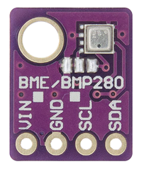
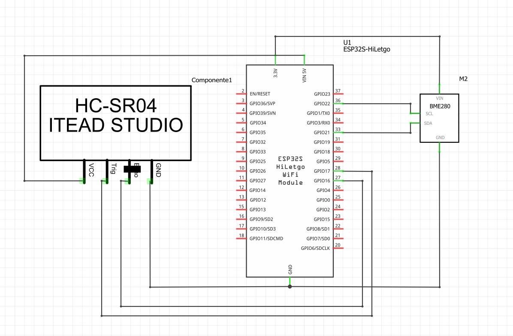

# embedded-system-ga

ESP32: MCU with integrated Wi-Fi and Bluetooth connectivity for a wide-range of applications

Sensor 1: HC-SR04 Ultrasonic Sensor

Leituras de distâncias entre 2cm e 4 metros

Precisão: 3mm

Envio de sinais ultrassonicos pelo sensor,que aguarda o retorno (echo) do sinal, e com base no tempo entre envio e retorno, calcula a distância entre o sensor e o objeto detectado.

*Image by: https://create.arduino.cc/projecthub/abdularbi17/ultrasonic-sensor-hc-sr04-with-arduino-tutorial-327ff6*

Sensor 2:

Complete Schematic:

